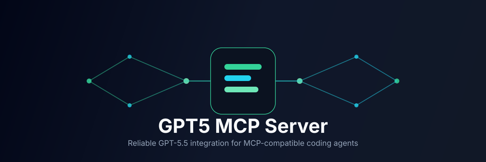

<p align="center">
  
</p>

<p align="center">
  
</p>

<h1 align="center">GPT5 MCP Server</h1>

<p align="center">
  <strong>MCP server for GPT-5.5 API integration with Antigravity IDE</strong>
</p>

<p align="center">
  
  = 18" />
  
  
</p>

---

## What It Does

GPT5 MCP Server is a standalone [Model Context Protocol](https://modelcontextprotocol.io/) server that exposes GPT-5.5 capabilities as MCP tools — ready to use with any MCP-compatible IDE or agent: Antigravity, Claude Code, Codex CLI, Cursor, Cline, OpenClaw, and more.

Instead of copy-pasting prompts or switching context, agents call named tools like `gpt5_code_complete`, `gpt5_code_review`, or `gpt5_refactor` and get structured, repeatable AI assistance built into their workflow.

---

## Features

| Tool | Description |
|---|---|
| `gpt5_code_complete` | Generate code from natural language prompts |
| `gpt5_code_review` | Review code for bugs, performance, security, style |
| `gpt5_refactor` | Refactor code with specific goals |
| `gpt5_explain_code` | Explain code in detail |
| `gpt5_debug` | Debug and find issues |

---

## Architecture

```
┌─────────────────────────────────────────────────────────────────────┐
│                           Agent / IDE                               │
│              Antigravity · Claude Code · Codex CLI                 │
│                Cursor · Cline · OpenClaw · Cline                    │
└───────────────────────────────┬─────────────────────────────────────┘
                                │ MCP (stdio / SSE)
                                ▼
┌─────────────────────────────────────────────────────────────────────┐
│                      GPT5 MCP Server (Node.js)                      │
│                      Tools: code_complete · code_review             │
│                      Refactor · explain_code · debug                 │
└───────────────────────────────┬─────────────────────────────────────┘
                                │ HTTPS
                                ▼
┌─────────────────────────────────────────────────────────────────────┐
│                           GPT-5.5 API                               │
│                           API endpoint                               │
└─────────────────────────────────────────────────────────────────────┘
```

---

## Quick Start

### 1. Install & Build

```bash
git clone https://github.com/your-org/gpt5-mcp-server.git
cd gpt5-mcp-server
npm install
npm run build
```

### 2. Configure

Set your API key:

```bash
export GPT5_API_KEY="your-gpt5-api-key-here"
```

Or copy and edit the env file:

```bash
cp .env.example .env
# Then edit .env with your GPT5_API_KEY
```

### 3. Run

**Node.js (local):**
```bash
npm start
```

**Docker (recommended for production):**
```bash
docker compose up -d
```

---

## Configuration

| Variable | Required | Default | Description |
|---|---|---|---|
| `GPT5_API_KEY` | Yes | — | API key for GPT-5.5 |
| `GPT5_API_URL` | No | `https://api.openai.com/v1` | API endpoint |
| `API_TIMEOUT` | No | `60000` | Request timeout in ms |
| `MAX_TOKENS` | No | `4096` | Max tokens per response |

---

## Usage in Antigravity IDE

```text
@gpt5_code_complete Write a hello world function in Python
@gpt5_code_review focus="security" language="javascript"
@gpt5_refactor goal="improve performance" language="python"
@gpt5_explain_code file="src/utils.ts"
@gpt5_debug error="TypeError: Cannot read property 'map' of undefined"
```

### VS Code / Cursor

Add to your MCP settings:

```json
{
  "mcpServers": {
    "gpt5": {
      "command": "node",
      "args": ["/path/to/gpt5-mcp-server/dist/index.js"],
      "env": {
        "GPT5_API_KEY": "your-api-key"
      }
    }
  }
}
```

---

## Project Structure

```
gpt5-mcp-server/
├── src/
│   ├── index.ts           # Server entry point
│   ├── config/            # Environment configuration
│   ├── types/             # TypeScript types
│   ├── api/               # GPT-5.5 API client
│   ├── tools/             # MCP tool definitions & handlers
│   └── utils/             # Utilities
│
├── assets/
│   ├── logo.svg           # Project logo
│   └── banner.svg         # Hero banner
│
├── dist/                   # Compiled JavaScript (gitignore)
├── docs/                  # Documentation
│   ├── QUICKSTART.md
│   ├── DEPLOYMENT.md
│   └── SECURITY.md
├── enhancements/          # Optional / experimental features
├── test/                   # Tests
│
├── Dockerfile
├── docker-compose.yml
├── ecosystem.config.js     # PM2 configuration
├── gpt5-mcp-server.service  # systemd unit file
├── LICENSE
├── package.json
├── README.md
└── tsconfig.json
```

---

## Documentation

- [Quick Start](docs/QUICKSTART.md) — 5-minute setup guide
- [Deployment](docs/DEPLOYMENT.md) — Production deployment
- [Security](docs/SECURITY.md) — Security best practices

---

## Tech Stack

| Concern | Package |
|---|---|
| MCP protocol | `@modelcontextprotocol/sdk` |
| HTTP client | `axios` |
| Language | TypeScript + Node.js 18+ |

---

## License

MIT
